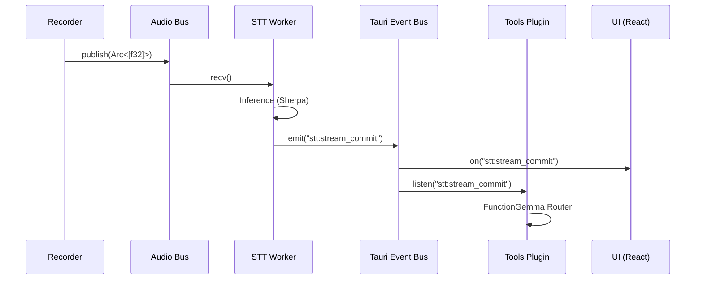

# Gibberish Architecture

Real-time speech-to-text transcription application built with Tauri + Rust.

## Crate Structure

```
crates/
├── application/     # Core application logic, streaming transcription
├── audio/           # Audio capture, resampling, AGC
├── bus/             # Low-latency audio bus for real-time streaming
├── detect/          # Language detection
├── diarization/     # Speaker diarization
├── models/          # Model management and downloading
├── parakeet/        # Parakeet ONNX-based STT engine
├── sherpa/          # Sherpa-ONNX streaming STT engine
├── smart-turn/      # Neural turn prediction
├── storage/         # Local database storage
├── stt/             # STT trait definitions and engine abstraction
├── transcript/      # Transcript data structures
├── turn/            # Turn prediction types
└── vad/             # Voice Activity Detection (Silero)

plugins/
├── detect/          # Language detection Tauri plugin
├── permissions/     # macOS permissions handling
├── recorder/        # Audio recording Tauri plugin
├── stt-worker/      # STT worker Tauri plugin
├── tools/           # FunctionGemma tool routing
└── tray/            # System tray plugin
```

## Event-Driven Orchestration

Gibberish uses a **two-tier event architecture** to balance high-performance data delivery with loose component coupling.

### 1. High-Bandwidth Tier (Audio Bus)
The `gibberish-bus` provides a dedicated Rust-native channel for raw audio.
- **Purpose**: Direct, zero-copy routing from the `Recorder` to the `STT Worker`.
- **Performance**: Bypasses the Tauri/JS bridge entirely for audio samples. This eliminates JSON serialization overhead and prevents UI-thread jank.
- **Backpressure**: Uses a bounded `mpsc` channel. If the STT engine lags, the bus tracks `dropped_chunks` and allows the listener to `drain_to_latest`, prioritizing real-time "now" over processing a backlog.

### 2. Control & Metadata Tier (Tauri Event Bus)
Uses Tauri's internal event system (`app.emit`, `app.listen`) for non-binary metadata.
- **Decoupling**: The `Tools` plugin has zero compile-time dependency on the `STT` plugin. It simply listens for `stt:stream_commit` events.
- **Reactive UI**: The React frontend is a passive consumer of events, updating the transcript and pipeline metrics only when the Rust core pushes changes.

### Communication Flow



## Audio Pipeline

### Data Flow

```
┌─────────────┐     ┌─────────────┐     ┌─────────────┐
│  Microphone │────>│  Audio Bus  │────>│ STT Worker  │
└─────────────┘     └─────────────┘     └─────────────┘
                          │                    │
                          │                    ▼
                    ┌─────▼─────┐       ┌─────────────┐
                    │ PipelineStatus    │  Transcript │
                    └───────────┘       └─────────────┘
```

### Audio Bus (`gibberish-bus`)

Zero-copy audio delivery using bounded channels:

- **AudioChunk**: Timestamped audio with sequence numbers for ordering
- **AudioBusSender**: Cloneable sender for the recorder plugin
- **AudioBusReceiver**: Single-consumer receiver for STT worker
- **PipelineStatus**: Real-time metrics (lag, RTF, dropped chunks)

Configuration targets 1.5s buffer capacity with 50ms chunks for responsive streaming.

### Audio Processing (`gibberish-audio`)

**Resampling**: High-quality sinc interpolation via `rubato::FftFixedIn`. Falls back to linear interpolation if rubato unavailable.

**AGC (Automatic Gain Control)**:
- Target level: -20 dBFS
- Noise floor: -50 dBFS
- Max gain: 10x, Min gain: 0.1x
- Smooth gain transitions with 0.1 attack/decay coefficient
- Soft clipping via tanh to prevent distortion

### Voice Activity Detection (`gibberish-vad`)

Silero VAD with configurable parameters:

```rust
VadSettings {
    redemption_time_ms: u32,  // Time after speech ends before committing
    min_speech_time_ms: u32,  // Minimum speech duration to trigger
}
```

Presets:
- **Dictation**: 300ms redemption, fast commits
- **Meeting**: 1000ms redemption, tolerates longer pauses
- **Default**: 500ms redemption, balanced

## Streaming STT (`gibberish-sherpa`)

### Latency Profiles

Configure decoder endpointing behavior:

| Profile   | Rule2 (Quick) | Rule1 (Long) | Min Utterance |
|-----------|---------------|--------------|---------------|
| Fast      | 0.3s          | 1.8s         | 0.5s          |
| Balanced  | 0.4s          | 2.4s         | 0.8s          |
| Accurate  | 0.8s          | 3.0s         | 1.2s          |

### Silence Injection

On VAD speech-to-silence transition, 100ms of silence samples are injected into the acoustic model to help reset decoder state and reduce hallucinations.

### Worker Architecture

Non-blocking inference via channel-based worker:

```rust
enum InferenceRequest {
    // Zero-copy: shares the Arc from the AudioBus directly
    Chunk { sample_rate: u32, samples: Arc<[f32]> },
    InjectSilence { sample_rate: u32 },
    Reset,
    Shutdown,
}
```

The worker runs on a dedicated thread, preventing mutex contention during decoding.

## Turn Prediction (`gibberish-turn`, `gibberish-smart-turn`)

Combines acoustic VAD boundaries with semantic analysis:

1. VAD detects speech end (silence after speech)
2. Turn predictor evaluates if utterance is semantically complete
3. If complete: commit transcript segment
4. If incomplete: cancel speech end, continue accumulating

## Application State (`gibberish-application`)

### StreamingTranscriber

Orchestrates streaming transcription with three focused components:

- **AudioBuffer**: Manages audio samples with timestamp tracking
- **VadState**: Tracks speech/silence boundaries and turn prediction
- **WordTracker**: Tracks word stability across decodes for smooth display

### Commit Strategy

1. **VAD-triggered**: Speech end + turn prediction = complete → commit
2. **Time-triggered**: Buffer exceeds threshold → commit stable words
3. **Word stability**: Words must appear consistently across multiple decodes

## Plugin Architecture

Each Tauri plugin is self-contained:

```rust
pub fn init<R: Runtime>() -> TauriPlugin<R> {
    Builder::new("plugin-name")
        .invoke_handler(tauri::generate_handler![...])
        .setup(|app, api| { ... })
        .build()
}
```

State is managed via `app.manage()` and accessed in commands via `State<T>`.

### Recorder Plugin

Publishes 50ms audio chunks to the AudioBus:

- Captures audio from microphone, system audio, or combined sources
- Resamples to 16kHz mono
- Applies AGC normalization
- Sends timestamped chunks to AudioBusSender (Zero-copy `Arc<[f32]>`)
- Emits `recorder:audio-level` for UI visualization

### STT Worker Plugin

Autonomous audio processing via AudioBusReceiver:

**Audio Listener**: Background task controlled by `AudioListenerHandle`.
- **Restartability**: Uses `CancellationToken` for robust start/stop semantics.
- **State**: Uses `Arc<SttState>` to share model state with UI commands.
- **Process**:
    - Receives chunks from AudioBus
    - Updates `PipelineStatus` (lock-free)
    - Processes through VAD for speech boundaries
    - Runs STT inference via SherpaWorker
    - Emits transcript events

**Commands**:
- `stt_start_listening` - Start autonomous audio processing
- `stt_stop_listening` - Stop the audio listener
- `stt_is_listening` - Check listener status
- `stt_get_pipeline_status` - Get real-time metrics

### Tools Plugin

Triggers contextual tools from transcript text using FunctionGemma inference.

**Architecture**:

```
┌─────────────────┐     ┌─────────────────┐     ┌─────────────────┐
│  STT Commit     │────>│     Router      │────>│    Executor     │
│  (transcript)   │     │  (orchestration)│     │ (cache/cooldown)│
└─────────────────┘     └─────────────────┘     └─────────────────┘
                               │                        │
                               ▼                        ▼
                        ┌─────────────────┐     ┌─────────────────┐
                        │  FunctionGemma  │     │  ToolRegistry   │
                        │   (inference)   │     │ (tool dispatch) │
                        └─────────────────┘     └─────────────────┘
```

**Components**:

- **Router** (`router.rs`): Debounces STT commits, runs FunctionGemma inference, selects best proposal above confidence threshold
- **FunctionGemma** (`functiongemma.rs`): Local LLM that infers tool calls and arguments from natural language
- **ToolRegistry** (`registry.rs`): Settings-driven dispatch - builds tool instances from policy manifest
- **Executor** (`executor.rs`): Handles caching, cooldowns, and auto-run logic for read-only tools
- **Tool trait** (`tools/mod.rs`): Async interface for tool implementations

**State** (split by concern):

```rust
ToolsState {
    client: reqwest::Client,      // Shared HTTP client
    router: RouterState,          // Enabled, policies, pending text, inference cancel
    functiongemma: FunctionGemmaState,  // Model, download progress
    cache: CacheState,            // TTL-based result cache
}
```

**Policy constants** (`policy.rs`):
- `CITY_COOLDOWN`: 45s between queries for same city
- `DEBOUNCE`: 650ms delay before processing queued text
- `CACHE_TTL`: 15 minutes for cached results

## Events

Key events emitted to the frontend:

- `stt:stream_result` - Partial/final transcription updates
- `stt:stream_commit` - Committed transcript segment
- `stt:turn_prediction` - Turn prediction result
- `recorder:audio-level` - Audio level for visualization

## Pipeline Status

Real-time observability metrics implementation (`crates/bus`):

**Lock-free Atomic Updates**:
The `PipelineStatus` struct uses `AtomicI64`/`AtomicU64` fields, allowing the high-frequency audio loop to update lag and counters without mutex contention.

```rust
PipelineStatus {
    audio_lag_ms: AtomicI64,      // Latency from capture to processing
    inference_time_ms: AtomicU64, // Last inference duration
    real_time_factor: AtomicU32,  // RTF (bits)
    dropped_chunks: AtomicU64,    // Overrun count
    gaps_detected: AtomicU64,     // Missing sequence numbers
    decode_rate_hz: AtomicU32,    // Decodes per second (bits)
    chunks_processed: AtomicU64,  // Total chunks handled
    audio_processed_ms: AtomicU64 // Total audio duration
}
```
