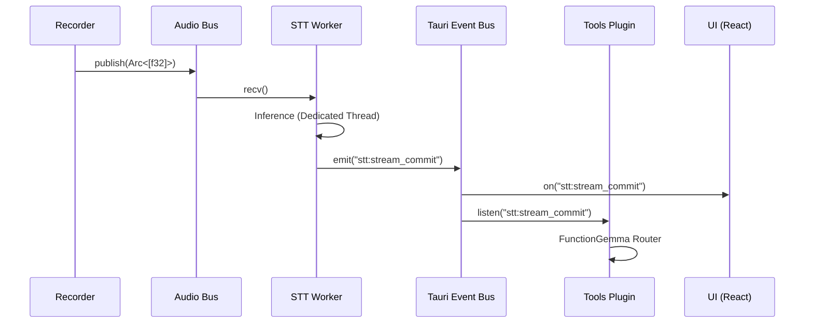

# Gibberish // The Golden Path

> **"Intelligence without the cloud."**

Welcome to the architectural manifesto of Gibberish. This document is a survival guide for building high-performance, local-first AI without selling your soul (or your user's data) to a cloud provider.

---

## 1. The Philosophy (Or: Why We Did This)

We hold three core beliefs that drive every line of code:

### 1.1. Privacy isn't a Toggle, it's a Topology
**Your voice never leaves `localhost`.**
-   **The Rule:** No OpenAI. No Google Speech API. No AWS Transcribe.
-   **The Tech:** All models run on-device using **ONNX Runtime** and quantized models (int8).
-   **The Win:** Zero latency, zero fees, and zero chance of a third party reading your transcripts.

### 1.2. Latency is the Enemy
**Transcription must feel faster than thought.**
-   **The Metric:** Time-to-first-token must be **< 200ms**.
-   **The Implementation:** We don't use HTTP or JSON for audio. We built a **Zero-Copy Audio Bus** in Rust that streams raw floats from the mic to the model via memory-efficient `Arc` pointers.

### 1.3. Rust + Tauri (Efficiency over Ease)
**We build for the metal, not the browser.**
-   **The Stack:** Rust for the heavy lifting. Tauri for the pretty pixels.
-   **The Result:** A 15MB binary that idles at <200MB RAM.
-   **The Engine:** Pure Rust running on dedicated OS threads, decoupled from the UI's event loop.

---

## 2. Core Features & Implementation

### 2.1. The Hybrid Inference Engine
We support two modes of operation, selectable at runtime:
1.  **Streaming (Sherpa-ONNX Zipformer):**
    -   *Use Case:* Dictation, instant feedback.
    -   *Tech:* Transducer architecture. Returns partial results every ~50ms.
2.  **Batch (Parakeet TDT / Whisper):**
    -   *Use Case:* High accuracy, archival.
    -   *Tech:* Encoder-Decoder / CTC. Runs on VAD-segmented chunks.

### 2.2. Smart Turn Detection (The "Daily.co" Method)
Standard VAD only detects *silence*. Smart Turn detects *completion*.
-   **Problem:** Pausing to think ≠ finishing a sentence.
-   **Solution:** We implement a **Neural Turn Detector** (inspired by Daily.co's research). It analyzes the *semantic probability* of the current text buffer.
-   **The Logic:** `if (Silence > 300ms AND Probability(EndOfSentence) > 0.5) -> Commit`.

### 2.3. Agentic Tools ("Assistant Mode")
A local LLM (`FunctionGemma`) handles intents without leaking data. It is **Context-Aware**, meaning it only knows about tools relevant to your current activity.

-   **Flow:**
    1.  User: "Search Wikipedia for Rust."
    2.  **Context Engine**: Detects you are in "Dev Mode" (VS Code focused).
    3.  **Router**: Filters available tools (Git, File Search, Wikipedia).
    4.  **LLM**: Parses intent -> `{"tool": "wikipedia", ...}`.
    5.  **Executor**: Runs the tool.

---

## 3. The Nervous System (Architecture)

Gibberish is organized as a **Modular Monolith** Cargo workspace.

```
crates/
├── application/     # The Body (Orchestration & State Machine)
├── audio/           # The Senses (Capture, AGC, Resampling)
├── bus/             # The Nervous System (Bounded MPSC Audio Pipeline)
├── context/         # The Senses (Active App, Mic State, System Context)
├── detect/          # Context Awareness (Meeting App Detection)
├── diarization/     # Speaker ID (Trait Definitions)
├── models/          # The Library (Metadata & Download Registry)
├── parakeet/        # STT Backend (NVIDIA Parakeet/TDT)
├── sherpa/          # STT Backend (Sherpa-ONNX Streaming)
├── smart-turn/      # The Intuition (Semantic End-pointing)
├── storage/         # The Memory (Local SQLite Storage)
├── stt/             # The Ears (Engine Traits & Abstractions)
├── transcript/      # The Records (Data Structures)
├── turn/            # Endpointing Types
└── vad/             # The Reflexes (Silero VAD)
```

### 3.1. The Zero-Copy Audio Bus (`gibberish-bus`)
The critical path for performance. Bypasses Tauri's IPC completely.

```mermaid
graph LR
    Mic[Microphone (cpal)] -->|Raw Samples| Recorder
    Recorder -->|Arc<[f32]>| Bus[MPSC Channel]
    Bus -->|Borrow| VAD[Silero VAD]
    Bus -->|Borrow| STT[Sherpa ONNX]
    STT -->|Text Event| UI[Frontend]
```

-   **Zero-Copy:** We allocate the audio buffer once. All consumers (VAD, STT) receive an `Arc<[f32]>` (shared pointer), avoiding redundant memory copies.
-   **Backpressure:** Uses a bounded `tokio::sync::mpsc` channel. If the engine lags, the bus tracks `dropped_chunks` and allows the listener to `drain_to_latest`, prioritizing real-time "now" over a stale backlog.

### 3.2. Event-Driven Communication
We use a **Two-Tier** event system to balance performance and coupling:

1.  **Data Tier (Rust Internal):**
    -   Uses `tokio::sync::mpsc` for audio delivery.
    -   Uses `tokio::sync::broadcast` for global control signals (Start, Stop, Reset).
2.  **Control Tier (Rust -> Frontend):**
    -   Tauri Events (`emit`) for non-binary metadata (Transcripts, Metrics).
    -   Reactive UI: The React frontend is a passive consumer, updating only when the Rust core pushes segments.



---

## 4. Key Technical Decisions (The "Why")

### Why Tauri v2?
Electron bundles an entire browser just to render a UI. Tauri uses the OS's native webview and provides a secure Rust-based plugin system. Security is strictly enforced via permissions in `plugins/*/permissions`.

### Why ONNX Runtime?
It is the gold standard for on-device inference. It supports **CoreML** (Apple Neural Engine) out of the box, allowing us to run heavy models without spinning the fans or melting the battery.

### Why separate Plugins?
We organized features into `plugins/` (Recorder, STT, Tools). This forces **Dependency Inversion**. The plugins are just "Adapters" that glue the pure Rust crates to the Tauri runtime.

---

## 5. Developer Guide: Adding a Feature

1.  **The Engine Room (`crates/`):** Write your logic in a new crate. Pure Rust.
2.  **The Adapter (`plugins/`):** Create a Tauri Plugin to expose commands/events.
3.  **The Permissions:** Update `permissions/autogenerated` to allow specific command access.
4.  **The UI:** Consume via `invoke('plugin:command')`.

---

## 6. Future Proofing: The Headless Engine

The core business logic resides entirely in `crates/`, with **zero dependencies on Tauri or HTML**.
-   **The Engine:** Pure Rust structs (e.g., `StreamingTranscriber`) that take input and emit events.
-   **The Future:** Want a native SwiftUI app? Simply delete the `plugins/` layer and use FFI to call the Rust crates directly.

---

## 7. Expanding Horizons: New Languages

### Case Study: Adding Catalan
We found a high-quality Catalan model on Hugging Face, but it was in PyTorch format.
-   **The Problem:** Rust cannot natively run PyTorch `.ckpt` files efficiently.
-   **The Fix:** We wrote `scripts/export_nemo_ctc.py`. It loads the model in Python, traces it, and exports an optimized **ONNX** file and `vocab.txt`.
-   **The Lesson:** Python is for training/conversion; Rust is for high-performance execution.

---

## 8. Engineering Notes (The Secret Sauce)

### 8.1. "Simulated Streaming" for Batch Models
Batch models are accurate but slow.
-   **The Trick:** We run them in a loop every 500ms on the *partial* buffer.
-   **The UX:** Users see "volatile" draft text. When a sentence is finished (VAD trigger), we run the final decode for the "stable" commit.

### 8.2. Silence Injection
Streaming decoders can hallucinate during long silences.
-   **The Fix:** When VAD detects silence, we feed 100ms of zeros into the decoder. This resets the internal state and prevents "Thank you. Thank you." loops.

### 8.3. Atomic Observability
Measuring latency shouldn't cause more latency.
-   **The Solution:** We use `std::sync::atomic` for all real-time metrics (`PipelineStatus`). The high-priority audio thread updates `latency_ms` without locking; the UI thread reads it safely without contention.

### 8.4. Audio Hygiene
-   **Resampling:** `rubato` (Sinc interpolation) upsamples everything to 16kHz mono.
-   **AGC:** Soft-clipping (`tanh`) Automatic Gain Control targets **-20 dBFS**, ensuring the model gets consistent levels regardless of the user's microphone.

### 8.5. Threading Model
We use `std::thread` for inference, not `tokio::spawn`.
-   **Why:** ONNX inference is CPU-bound and blocking. If it ran on the Tokio async runtime, it would starve the event loop, causing dropped audio and UI freezes.

---

## 9. OS Integration (The Context Engine)

We don't just listen to you; we listen to your computer.

### The Context Loop
The `crates/context` crate polls the OS (via AppleScript or Accessibility APIs) to build a realtime snapshot of your world:
1.  **Focus:** What app are you using? (VS Code -> **Dev Mode**)
2.  **Activity:** Is the mic active in Zoom? (Mic On -> **Meeting Mode**)
3.  **State:** What's in the clipboard?

### Why?
This enables **Dynamic Tooling**.
-   In **Dev Mode**, you can say "Undo commit" (`git_voice`).
-   In **Meeting Mode**, you can say "Flag this" (`transcript_marker`).
-   The LLM is never confused because irrelevant tools are hidden from its prompt.

---

## 10. Clean Architecture (Dependency Inversion)

We use the **Strategy Pattern** to support multiple engines without spaghetti code.

### The `SttEngine` Trait
`crates/application` never depends on `Sherpa` or `Parakeet` directly. It depends on the `SttEngine` trait (`crates/stt/src/engine.rs`).
-   **Result:** Adding a new engine (e.g., `WhisperTurbo`) only requires implementing the trait and registering a loader. No core application logic needs to change.

---

## 11. Future Roadmap (The "Not-Yet" List)

Building a local-first engine is a marathon. Here’s what’s on the horizon:

### 11.1. Diarization (Who is speaking?)
The `crates/diarization` crate exists as a skeleton. We have the traits ready, but we're waiting for an on-device Speaker ID model that fits our privacy and performance constraints. Once integrated, Gibberish will tag "Speaker 1" and "Speaker 2" in real-time.

### 11.2. Always-On (The Rolling Privacy Buffer)
We are exploring an **"Always-On but NOT recording"** mode.
-   **The Concept:** The app listens continuously and keeps the last 60 seconds of audio in a circular RAM-only buffer.
-   **The Trigger:** If you realize you're in an important conversation, you hit "Record" and Gibberish "catches up" by transcribing the last minute from memory.
-   **The Privacy:** If you don't hit record, the audio is overwritten in RAM and never touches the disk. Pure ephemeral intelligence.