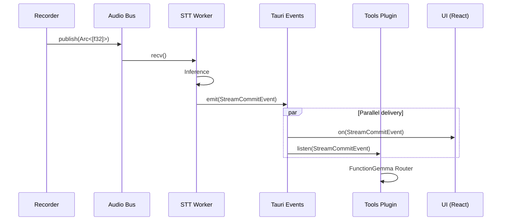

# Event System

Components communicate through events, not direct function calls. This enables loose coupling and easy extensibility.

## The Contract (`crates/events`)

We avoid "stringly typed" programming by defining all event payloads in a shared crate.

```rust
// crates/events/src/lib.rs
#[derive(Serialize, Deserialize)]
pub struct StreamCommitEvent {
    pub text: String,
    pub confidence: f32,
}
```

This ensures that:
1.  **Type Safety:** Producers and consumers must agree on the struct definition.
2.  **No Typos:** Event names are constants (`events::STT_STREAM_COMMIT`).
3.  **Versioning:** Changes to the contract break the build, not runtime.

## Two-Tier Architecture

We separate high-frequency data from low-frequency control:

### Tier 1: Data (Rust Internal)

High-bandwidth, binary data that never leaves Rust:

| Channel | Type | Purpose |
|---------|------|---------|
| `tokio::sync::mpsc` | Bounded | Audio chunks |
| `tokio::sync::broadcast` | Unbounded | Control signals |

### Tier 2: Control (Rust → Frontend)

Low-bandwidth metadata sent to the UI:

| Event | Payload | Frequency |
|-------|---------|-----------|
| `stt:stream_commit` | `StreamCommitEvent` | ~1/sec |
| `context:changed` | `ContextChangedEvent` | On focus change |

## Event Flow

