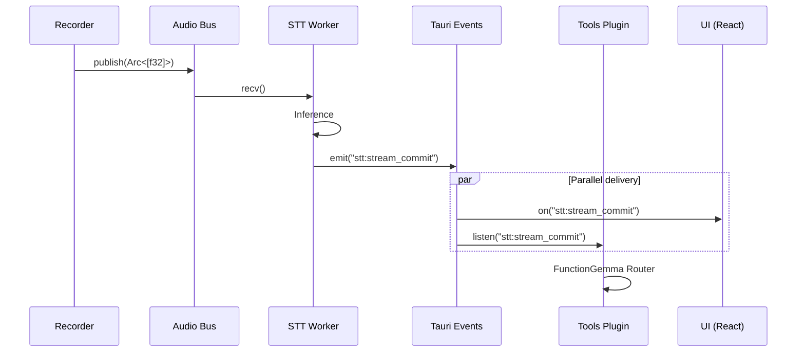

# Event System

Components communicate through events, not direct function calls. This enables loose coupling and easy extensibility.

## Two-Tier Architecture

We separate high-frequency data from low-frequency control:

### Tier 1: Data (Rust Internal)

High-bandwidth, binary data that never leaves Rust:

| Channel | Type | Purpose |
|---------|------|---------|
| `tokio::sync::mpsc` | Bounded | Audio chunks |
| `tokio::sync::broadcast` | Unbounded | Control signals |

```rust
// Audio delivery (high frequency, ~50 chunks/sec)
let (tx, rx) = mpsc::channel::<AudioChunk>(100);

// Control signals (low frequency)
let (ctrl_tx, _) = broadcast::channel::<ControlSignal>(16);
```

### Tier 2: Control (Rust → Frontend)

Low-bandwidth metadata sent to the UI:

| Event | Payload | Frequency |
|-------|---------|-----------|
| `stt:stream_update` | Partial text | ~20/sec |
| `stt:stream_commit` | Final segment | ~1/sec |
| `recorder:status` | Recording state | On change |
| `metrics:update` | Pipeline stats | 1/sec |

```rust
// Tauri event emission
app.emit("stt:stream_commit", &Segment {
    text: "Hello world".into(),
    start_ms: 0,
    end_ms: 1500,
    is_final: true,
})?;
```

## Event Flow



## Control Signals

The broadcast channel carries global control signals:

```rust
pub enum ControlSignal {
    Start,           // Begin recording
    Stop,            // Stop recording
    Reset,           // Clear state
    ModelChanged,    // Reload engine
    ConfigChanged,   // Update settings
}
```

Multiple subscribers receive every signal:

```rust
// STT Worker subscribes
let mut rx = ctrl_tx.subscribe();
tokio::spawn(async move {
    while let Ok(signal) = rx.recv().await {
        match signal {
            ControlSignal::Stop => engine.flush(),
            ControlSignal::Reset => engine.reset(),
            _ => {}
        }
    }
});
```

## Frontend Consumption

React components subscribe to Tauri events:

```typescript
import { listen } from '@tauri-apps/api/event';

useEffect(() => {
    const unlisten = listen<Segment>('stt:stream_commit', (event) => {
        setTranscript(prev => [...prev, event.payload]);
    });

    return () => { unlisten.then(f => f()); };
}, []);
```

## Why Events?

### Decoupling

The STT worker doesn't know who consumes its output:

```rust
// STT Worker just emits
app.emit("stt:stream_commit", &segment)?;

// Could be consumed by:
// - UI (displays text)
// - Tools plugin (checks for intents)
// - Storage plugin (saves to database)
// - Analytics (tracks usage)
```

Adding a new consumer requires **zero changes** to the producer.

### Testability

Events can be mocked or recorded:

```rust
#[test]
fn test_stt_emits_commit() {
    let (tx, rx) = channel();
    let mock_app = MockApp::new(tx);

    stt_worker.process_audio(&audio, &mock_app);

    let event = rx.recv().unwrap();
    assert_eq!(event.name, "stt:stream_commit");
}
```

### Replay

Events can be logged and replayed for debugging:

```rust
// Record
events.push(Event {
    name: "stt:stream_commit",
    payload: segment.clone(),
    timestamp: now(),
});

// Replay
for event in saved_events {
    app.emit(&event.name, &event.payload)?;
}
```

## Performance Considerations

### Serialization Cost

Tauri events serialize to JSON. For high-frequency events, this matters:

```rust
// Bad: Emit raw audio (huge JSON)
app.emit("audio:chunk", &samples)?; // Don't do this!

// Good: Emit only metadata
app.emit("audio:level", &AudioLevel { db: -20.5 })?;
```

We keep audio in Rust-only channels and only emit text/metadata to the frontend.

### Batching

For very high-frequency updates, batch before emitting:

```rust
// Instead of 20 events/sec, batch to 4 events/sec
let mut buffer = Vec::new();
while let Some(update) = rx.recv().await {
    buffer.push(update);
    if buffer.len() >= 5 || timeout_elapsed {
        app.emit("stt:stream_batch", &buffer)?;
        buffer.clear();
    }
}
```
